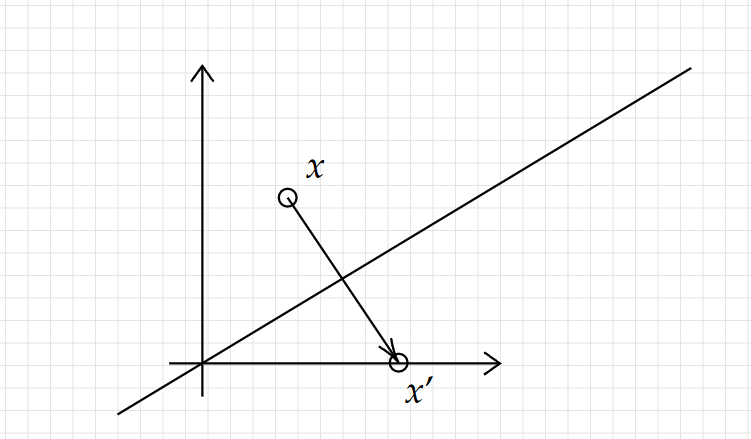
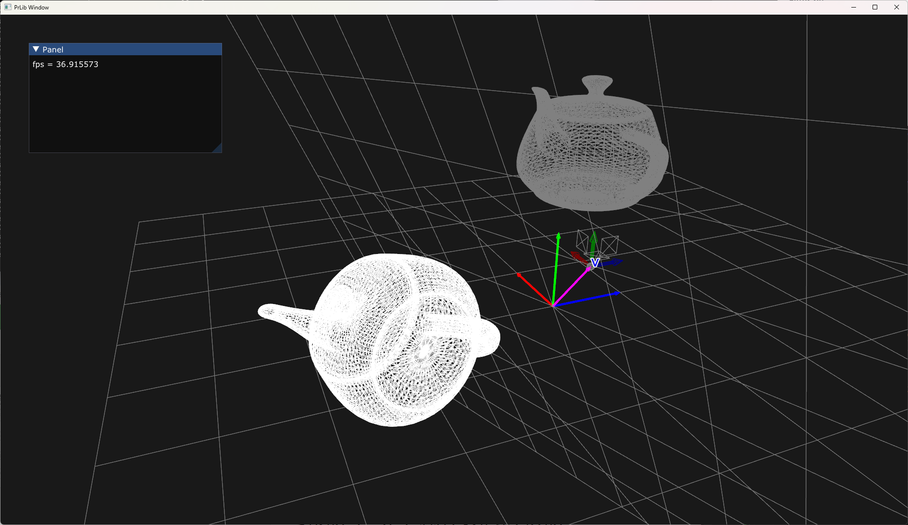

## A simple householder (Reflection) transform



where $ v = x' - x $ As a standard reflection transform 

$$
 \begin{array}{l}
x'=x+\left( -\frac{v}{|v|} \cdot x\right) 2\frac{v}{|v|}\\
x'=x-2\frac{v\cdot x}{v\cdot v} v
\end{array}
$$

Let's try to make a matrix form P.

$$
\begin{aligned}
Px & =x-2\frac{v\cdot x}{v\cdot v} v\\
 & =x-2\frac{v^{T} x}{v^{T} v} v\\
 & =x-2\frac{vv^{T}}{v^{T} v} x\\
 & =\left( I-2\frac{vv^{T}}{v^{T} v}\right) x
\end{aligned}
$$

Thus, it's $P=I-2\frac{vv^{T}}{v^{T} v}$

As an implementation,
```
            glm::mat3 vvt = glm::mat3(
                V.x * V.x, V.x * V.y, V.x * V.z,
                V.x * V.y, V.y * V.y, V.z * V.y,
                V.x * V.z, V.y * V.z, V.z * V.z
            );
            glm::mat3 householder = glm::identity<glm::mat3>() - vvt * (2.0f / glm::dot(V, V));
```



## build

```
git submodule update --init
premake5 vs2022
```
